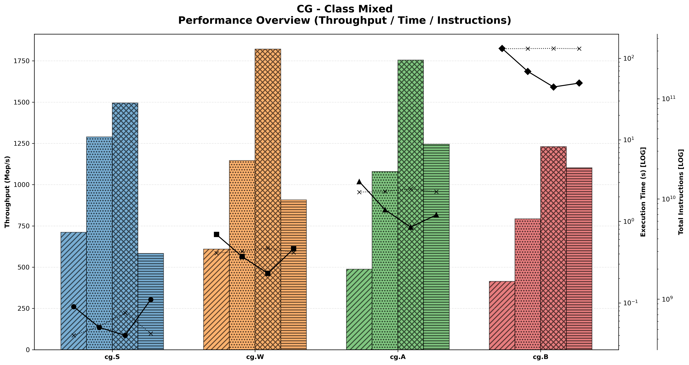
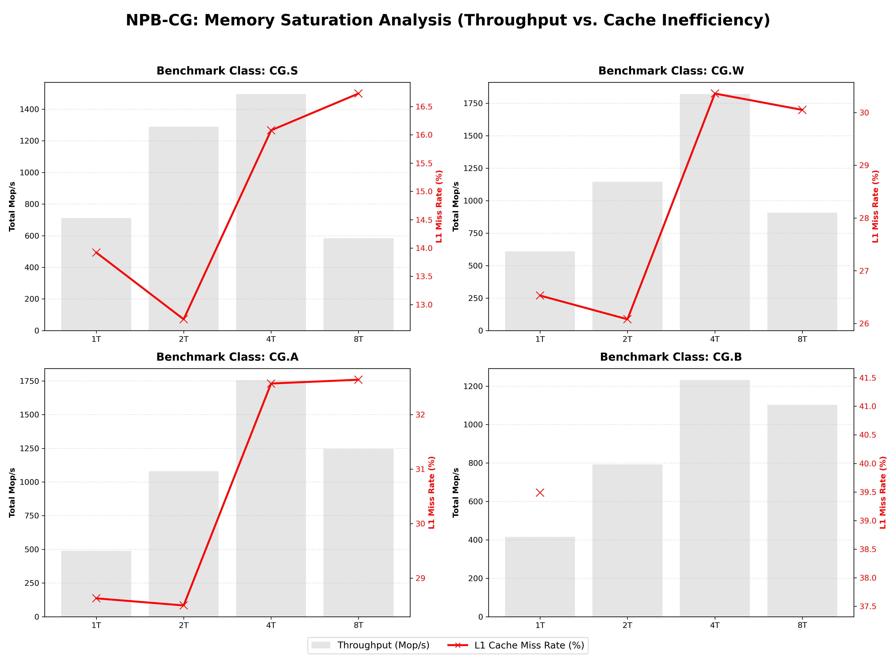
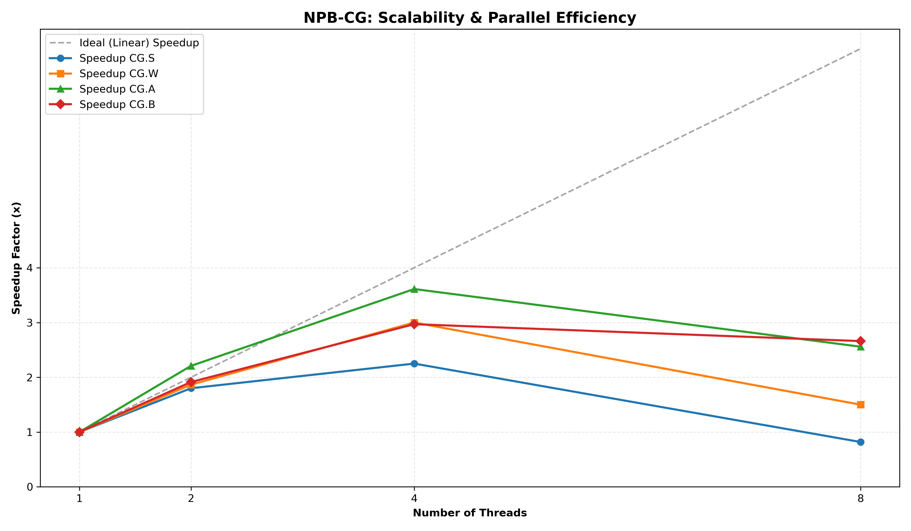
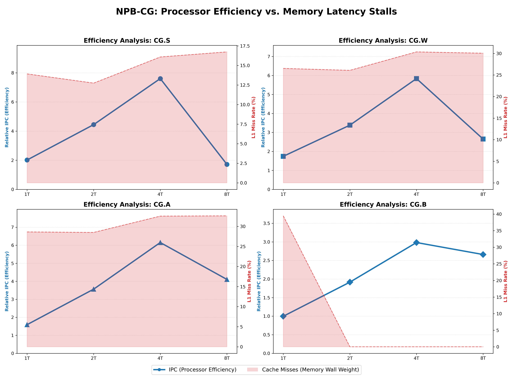

# HPC Performance Analysis for the NAS Parallel Benchmarks


This repository contains an automated, end-to-end pipeline designed to extract, transform, and visualize High-Performance Computing (HPC) metrics. Specifically, it analyzes the **NAS Parallel Benchmarks (NPB-CG)** to expose the "Memory Wall" effect and evaluate multi-threaded scalability bottlenecks.

> **In-Depth Analysis & Logs:** Inside the [`docs/`](./docs/) directory, you will find my comprehensive analysis of different NAS Parallel Benchmarks, alongside the raw execution logs, mathematical bandwidth models, and detailed architectural breakdowns. The report is presented as a concise, 3-page executive summary for rapid technical reading.

---

## Visual Analytics Gallery

The pipeline automatically generates a suite of advanced visualizations to diagnose bottlenecks. _(Note: The images below are dynamically generated by the pipeline)_.

### 1. The Big Picture: Time, Throughput & Instructions

Displays the relationship between raw throughput (Mop/s), total execution time, and the overall instruction count across different thread configurations using a multi-axis layout.


### 2. The Smoking Gun: Memory Saturation

Correlates the total workload throughput (bars) with the L1 Cache Miss Rate (line). This visualization is designed to identify potential memory bandwidth constraints by contrasting computation speed against cache behavior.


### 3. Scaling Efficiency: Parallel Speedup

Tracks the empirical speedup ($T_1 / T_n$) achieved as the thread count increases, plotting it against the theoretical ideal linear scaling to evaluate the parallel efficiency of the workload.


### 4. Processor Starvation: IPC Efficiency

Maps Instructions Per Cycle (IPC) alongside LLC (L3) Cache miss rates. This provides insight into how memory hierarchy latency and cache thrashing impact the raw computational efficiency of the CPU cores.


These are some of the generated plots. You can easily add your own plots, to visualize and analyze the data. Simply add your new plots to the `visualizations.py` script and ensure to import and launch it from `analyze_performance.py` and `npb_analysis.ipynb` (only if you want to!).
If you're planning to add plots to comparate different architectures, import and launch from `compare_architectures.py`.

---

## Aim of this project

This project started as small **Bash scripts** to quickly parse and visualize results from the different benchmarks and tools used during the analysis. Then, it evolved into a full **pipeline** capable of generating complex plots to visualize the data.

While the main objective was the **architectural analysis** of the benchmark results, this project also served as my introduction to **Jupyter Notebooks**, as well as **Pandas, NumPy, and Matplotlib**.

This pipeline is designed to be improved and will serve as the foundation for my future benchmark analyses.

## Detailed reports:

### CG Benchmark

Sparse matrix computations (like Conjugate Gradient) exhibit highly irregular memory access patterns. This defeats spatial locality in CPU caches, starving the processor of data. This project proves empirically how adding more threads to a memory-bound problem on legacy hardware (Intel Xeon Westmere) leads to performance degradation, and how modern architectures (AMD Ryzen Zen 3) overcome it.
Full report and analysis in: [`docs/cg_analysis/cg_analysis.pdf`](./docs/cg_analysis/cg_analysis.pdf)

## Architecture & Pipeline

The project strictly separates concerns, applying software engineering best practices to data analysis:

```text
.
├── data/                  # Raw Intel PIN logs & generated CSVs
├── notebooks/             # Jupyter environment for interactive EDA
├── plots/                 # Auto-generated visualization artifacts
├── scripts/
│   ├── etl.py             # Data Extraction & Transformation (Parsers)
│   ├── visualizations.py  # Matplotlib plotting logic
│   ├── analyze_performance.py # Main Orchestrator
│   └── compare_architectures.py # Cross-CPU comparison logic
└── Makefile               # The brains of the automation

```

---

### Interactive Exploratory Data Analysis (EDA)

For a step-by-step walkthrough of the visualization logic, dynamic chart rendering, and exploratory data analysis, you can launch the provided Jupyter environment. This is especially useful for inspecting the Pandas DataFrames before they are plotted.

```bash
jupyter notebook notebooks/npb_analysis.ipynb
```

## Usage & Automation

The entire workflow is governed by a `Makefile` that uses orquestrates the data processing and chart-generation. It's modularity allows to generate specific benchmark results or plots. You can also generate a comparison with your processor.

## Flow example

0. Perform the tests and generate the raw resuts. You can use the scripts in the `scripts` folder or create your own in your own environment.
1. Put the raw benchmark results in the `xeon_results/{benchmark}` folder. \*\*Note that all names can be changed in `style_config.py`
2. Once you've updated the name requirements, simply run `make all`

Example of plots generation:

```bash
ubuntu@ubuntu:~/your-folder$ make
========================================
=> Starting pipeline for: cg
========================================
python3 scripts/analyze_performance.py --app cg
[*] Running full ETL for CG...
[*] Created missing output directory: /your-folder/data/xeon_csv/cg
[*] CSV Generated: /your-folder/data/xeon_csv/cg/cg_parsed_results_full.csv
[*] Created plot directory: /your-folder/plots/xeon/cg
[*] Generating all visualizations in /your-folder/plots/xeon/cg...
[*] Chart Generated: /your-folder/plots/xeon/cg/cg_triple_axis_performance.png
[*] Chart Generated: /your-folder/plots/xeon/cg/cg_instructions_vs_time.png
[*] Chart Generated: /your-folder/plots/xeon/cg/cg_amat_analysis.png
[*] Speedup Chart Generated: /your-folder/plots/xeon/cg/cg_parallel_speedup.png
[*] Saturation Grid Generated: /your-folder/plots/xeon/cg/cg_memory_saturation_grid.png
[*] IPC Efficiency Grid Generated: /your-folder/plots/xeon/cg/cg_ipc_efficiency_grid.png
=> Pipeline finished. ✅
=> Analysis for cg completed successfully. ✅

========================================
=> Starting pipeline for: ep
========================================
python3 scripts/analyze_performance.py --app ep
[*] Running full ETL for EP...
[*] Created missing output directory: /your-folder/data/xeon_csv/ep
[*] CSV Generated: /your-folder/data/xeon_csv/ep/ep_parsed_results_full.csv
[*] Created plot directory: /your-folder/plots/xeon/ep
[*] Generating all visualizations in /your-folder/plots/xeon/ep...
[*] Chart Generated: /your-folder/plots/xeon/ep/ep_triple_axis_performance.png
[*] Chart Generated: /your-folder/plots/xeon/ep/ep_instructions_vs_time.png
[*] Chart Generated: /your-folder/plots/xeon/ep/ep_amat_analysis.png
[*] Speedup Chart Generated: /your-folder/plots/xeon/ep/ep_parallel_speedup.png
[*] Saturation Grid Generated: /your-folder/plots/xeon/ep/ep_memory_saturation_grid.png
[*] IPC Efficiency Grid Generated: /your-folder/plots/xeon/ep/ep_ipc_efficiency_grid.png
=> Pipeline finished. ✅
=> Analysis for ep completed successfully. ✅

...


```

### One-Click Analytics

Process all raw logs, perform the ETL, and generate all plots:

```bash
make all
```

Process a specific benchmark target (e.g., `cg`, `lu`):

```bash
make cg
```

### Fast Iteration Mode (Plots Only)

Regenerate plots directly from existing CSVs in fractions of a second without re-parsing the raw logs:

```bash
make plots APP=cg
```

### Architectural Comparison

Generate comparative charts highlighting the generational gap between the legacy Xeon node and a modern Ryzen CPU:

```bash
make compare APP=cg
```

### State Management

```bash

# Clean plots and cache (Preserves heavy CSVs
make clean

# Deep clean of all generated CSVs and Plots

make fclean
```

---

## Resources & References

Official resources and documentation:

- **NAS Parallel Benchmarks (NPB):**
  - [Official NASA NPB Website](https://www.nas.nasa.gov/software/npb.html)
  - [NAS Parallel Benchmarks - Wikipedia](https://en.wikipedia.org/wiki/NAS_Parallel_Benchmarks)
- **Instrumentation & Profiling:**
  - [Intel PIN - A Dynamic Binary Instrumentation Tool](https://www.intel.com/content/www/us/en/developer/articles/tool/pin-a-dynamic-binary-instrumentation-tool.html)
  - [Linux `perf` PMU Profiling](https://perf.wiki.kernel.org/index.php/Main_Page)
- **Cluster Management:**
  - [Open Grid Engine (OGE) Documentation](http://gridscheduler.sourceforge.net/)
